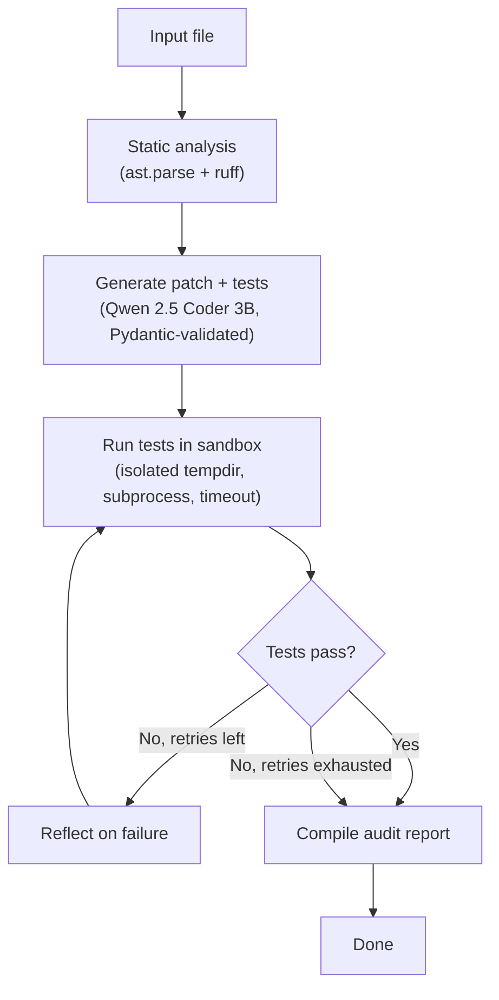

# Patchwork

A local, self-healing code-auditing agent. It reads a Python file, patches bugs, writes tests, and runs them in an isolated sandbox using a 4-bit quantized model (Qwen 2.5 Coder 3B) that fits on a 4GB laptop GPU.

Patchwork is also a 100-defect benchmark for measuring how well a 3B model can fix bugs on its own, and how much a reflection loop actually helps when it can't.

## What it does

Point it at a buggy Python file:

```bash
python -m patchwork.cli audit target.py --heal
```

The agent reads the file, runs `ruff` and `ast.parse` against it, sends the code to the model with instructions to find and fix the bug, and runs the model's own generated tests against its own patch in a sandboxed subprocess. If the tests fail and `--heal` is set, the agent feeds the failure output back to the model and tries again, up to 3 times. It writes the patched file, the test suite, and a Markdown audit report to disk.

Without `--heal`, it makes one attempt and reports the result. That's the difference between measuring what the model gets right immediately and what it can fix given a chance to see its own mistakes.

## Architecture



The graph is built with LangGraph. Every LLM call is schema-validated against a Pydantic model (`CodeAuditOutput`) before the graph trusts it: markdown fences get stripped, leaked test functions get removed from the patch, and anything that isn't parseable Python gets rejected outright and routed back through the reflection loop instead of silently becoming "the fix." Every subprocess call — `ruff`, `pytest` — runs with a hard timeout in a disposable temp directory. Every LLM call runs with its own timeout too, on a background thread, since a stuck generation can otherwise hang the whole process.

## Setup

```bash
python -m venv .venv
source .venv/bin/activate  # .venv\Scripts\activate on Windows
pip install -r requirements.txt
ollama pull qwen2.5-coder:3b
```

Requires Python 3.10+, [Ollama](https://ollama.com) running locally, and an NVIDIA GPU with 4GB+ VRAM. Developed and benchmarked on an RTX 3050 Laptop GPU.

## The benchmark

`benchmarks/dataset/` holds 100 buggy Python files across 21 categories, each paired with a hidden oracle test the agent never sees. The agent gets graded against the oracle, not its own self-written tests — a model that writes weak tests would otherwise score as "fixed" when it isn't.

```bash
python -m benchmarks.evaluate
```

This runs all 100 defects through the full agent graph, grades each result against its oracle, and writes `benchmarks/results.json`.

### Results

Run against `qwen2.5-coder:3b`, temperature 0.0, repeat penalty 1.05, on an RTX 3050 Laptop GPU (4GB VRAM), plugged into AC power.

| Metric | Value |
|---|---|
| Total defects | 100 |
| Categories | 21 |
| Pass@1 (fixed on first attempt) | 38% |
| Pass@overall (fixed within 3 retries) | 58% |
| Avg duration per defect | 7.80s |
| Avg peak VRAM | 2532 MB |

The reflection loop took the fix rate from 38% to 58% — 20 defects that failed on the first attempt got fixed once the model saw its own test failure and tried again.

### Where the model succeeds and where it doesn't

Performance splits cleanly by category. Eight categories hit 100% Pass@overall: mutable default arguments, resource leaks, division/rounding, iteration mutation, identity vs. equality, sort-in-place return values, bitwise vs. logical operators, and unhandled NoneType lookups. These are all patterns with a clear, local fix — swap one operator, wrap one block in a context manager, add one `is None` check.

Six categories hit 0% across every defect and every retry: float precision comparisons, generator exhaustion, string `.strip()` misuse, unhashable collections in sets, unescaped regex special characters, and off-by-one boundary conditions. These share a trait the first group doesn't: the bug isn't visible in the code's shape, only in its runtime behavior. `set()` on a list of dicts looks fine until you run it. `rstrip('.com')` looks like it strips a suffix; it strips a character set. A 3B model pattern-matches syntax well and simulates execution poorly.

### The confirmation bias problem

42 defects failed. Splitting them by whether the model's own self-written tests ever passed:

| Failure type | Count | Share of failures |
|---|---|---|
| Model's own tests passed, oracle disagreed | 28 | 67% |
| Model's own tests never passed, even after 3 retries | 14 | 33% |

Every one of the 28 confirmation-bias failures exited at retry 0 or 1. Every one of the 14 exhaustion failures used the full retry budget without ever satisfying even its own tests. There's no overlap between the two groups.

The pattern: when the model doesn't understand a bug well enough to fix it, it usually doesn't understand it well enough to write a test that would catch it either. It writes a test for the case it already handles correctly, watches that test pass, and exits believing the bug is fixed. The reflection loop never fires, because nothing told it to. This is why grading against a hidden oracle matters — grading the same run against the model's own tests would have shown a 66% pass rate instead of 58%, and every one of those extra 8 points would have been a bug the agent left in place while reporting success.

## Threats to validity

**Construct validity.** The gap between self-test pass rate and oracle pass rate (66% vs. 58%) is direct evidence that "the agent's own tests pass" is not a reliable stand-in for "the bug is fixed." That's the reason this benchmark grades against a held-out oracle at all.

**Internal validity.** Temperature is set to 0.0 for reproducibility, but llama.cpp / Ollama's execution isn't fully deterministic across runs on the same hardware — expect small variation (a few percentage points) if you rerun this yourself.

**External validity.** All 100 defects are isolated, single-file, single-function or single-class bugs with no external dependencies. This deliberately avoids the complexity of multi-file repositories, import resolution, and cross-module state, which is a different and harder problem than the one this benchmark measures. Nothing here claims to predict performance on a real codebase.

Category sizes aren't perfectly even (4-5 defects each), so per-category rates above should be read as directional, not precise. The defect-weighted overall rate (58%) and the unweighted average across all 21 categories (59.5%) are close enough that this imbalance doesn't meaningfully distort the headline number.

## Reliability guardrails

A handful of specific failure modes showed up during development and are handled explicitly, not just in theory:

- **Markdown-wrapped output.** The model sometimes wraps code in ` ```python ` fences even when told not to. Stripped before validation.
- **Test code leaking into the patch.** A reflection attempt once returned a `test_*` function mixed into the source patch. Now detected and stripped automatically; if stripping would break the syntax, the patch is rejected instead of silently corrupted.
- **Prose instead of code.** The model has returned a plain-English sentence in the `suggested_patch` field. Caught by an `ast.parse` check before the patch is ever trusted, not three steps later when the sandbox fails for a confusing reason.
- **Degenerate generation loops.** Observed once during benchmarking: a class-based defect caused the model to loop for 10+ minutes without producing output. `num_predict` now caps generation length, and every LLM call has an independent wall-clock timeout on a background thread.

## Project layout

```
patchwork/
├── cli.py                  # audit a single file from the command line
├── graph.py                 # the LangGraph state machine
├── state.py                  # AgentState, CodeAuditOutput schema + validators
├── report.py                  # Markdown audit report builder
├── tools/
│   ├── ast_inspector.py         # syntax validation, structural summary
│   ├── linter.py                  # ruff wrapper
│   └── sandbox.py                  # isolated pytest execution
└── telemetry/
    ├── profiler.py                  # VRAM/duration tracking
    └── logger.py                     # structured JSON logging

benchmarks/
├── dataset/                # 100 buggy files + 100 hidden oracle tests
├── manifest.py               # dataset schema and loaders
├── evaluate.py                 # runs the full benchmark, grades against oracles
└── results.json                  # latest benchmark run

tests/                      # 180+ tests, ~91% coverage
```

## Running the tests

```bash
ruff check patchwork/ tests/ benchmarks/
ruff format --check patchwork/ tests/ benchmarks/
mypy --strict patchwork/ benchmarks/ tests/
pytest tests/ -v --cov=patchwork --cov=benchmarks --cov-report=term-missing
```

## What's not here yet

- The CLI only fixes one file at a time; there's no batch mode outside the benchmark harness.
- No support for multi-file repositories or cross-file imports.
- The dataset could grow. 100 defects across 21 categories is enough for stable per-category rates, not enough to claim full coverage of Python's bug surface.
